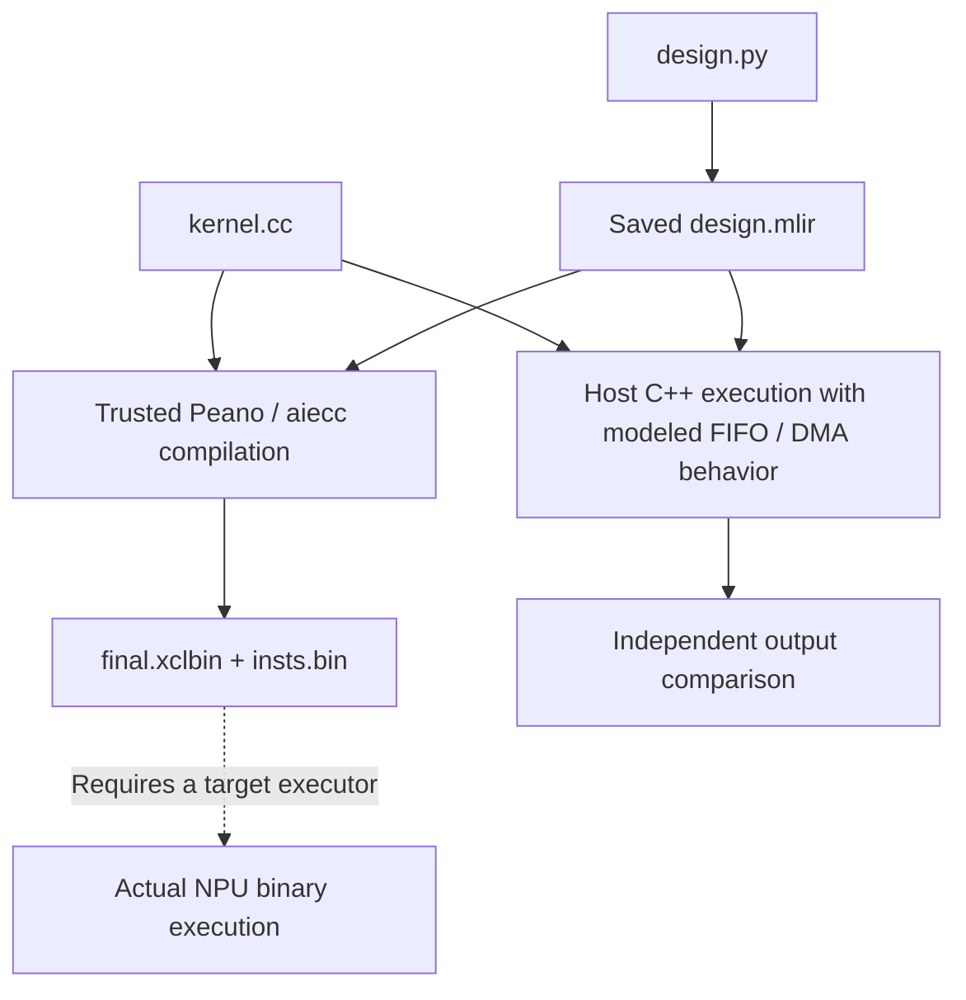
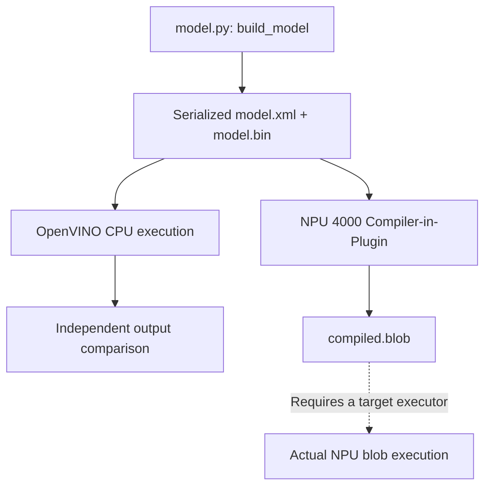

# Container simulation and hardware validation: AMD and Intel

**Report date:** September 9, 2026  
**Scope:** `npu-playground`, AMD XDNA2/NPU2 and Intel NPU 4000  
**Evidence:** repository implementation, saved acceptance results, and vendor documentation

## Assessment

The current containers establish **tested functional correctness at the source or
graph level and successful compilation for the selected NPU target**. Actual NPU
binary correctness, device integration, and measured device performance remain
unverified for both vendors.

The AMD and Intel environments validate different representations:

| Scenario | What executes without an NPU | What the target compiler produces | Current execution boundary |
| --- | --- | --- | --- |
| AMD XDNA2 | Supported C++ kernel bodies on the host, coordinated by a model of the emitted FIFO/DMA design | `final.xclbin` and `insts.bin`, containing or accompanying the target program | The emitted AIE2P machine code is not executed |
| Intel NPU 4000 | The serialized OpenVINO graph through the CPU backend | `compiled.blob` for the selected NPU platform | The exported NPU blob is not executed |

A container packages and isolates software. The compiler, host runtime, or simulator
inside it determines what can be checked. A container could also access a physical
NPU through a supported host configuration; that would be hardware execution.

Throughout this report, a validation pass means the tested implementation passed
its declared cases and tolerances. It is not a proof for every input, shape, schedule,
or device. Implementation details are documented in the
[validation guide](validation.md).

## AMD scenario: XDNA2 / NPU2

### Execution and compilation paths

The AMD candidate consists of `design.py` and `kernel.cc`. The supervisor emits the
design once, then uses the saved MLIR and kernel source in separate validation and
compilation paths.

The recorded toolchain is MLIR-AIE 1.4.2 with its pinned Peano compiler, targeting
AIE2P/NPU2. The simulator consumes the emitted design and invokes the candidate's
actual supported C++ bodies. Its arithmetic does not dispatch to the expected
oracle operation. The compiler independently builds the target program from those
saved inputs. See the [compiler adapter](../src/npu_agent/compilers.py) and
[AMD simulation implementation](../src/npu_agent/sim/amd_dataflow.py).

### What the AMD container can verify

| Area | Evidence available without hardware | Boundary of that evidence |
| --- | --- | --- |
| Kernel arithmetic | Actual host execution compared with an independent reference across multiple inputs | Host execution covers the approved C++ and intrinsic subset |
| Shapes, dtypes, indexing and tails | Declared ABI checks, output shape/dtype checks, and separately compiled static tail cases | Arbitrary layouts, aliases and dynamic contracts are not implicitly supported |
| Source memory safety | Address/undefined-behavior sanitizers, guarded buffers and checks for input mutation | These instrument the host executable, not the emitted NPU instructions |
| Data movement | Modeled DMA offsets/counts, FIFO contents and supported split/join operations | Only implemented transfer and layout semantics are covered |
| Synchronization | Acquire/release lifetimes, bounded queues, broadcast reclamation and deadlock diagnostics | Tested schedules do not cover every possible device schedule or physical timing effect |
| Compilation | MLIR device verification, target compilation, linking, entry-symbol checks and artifact inspection | Compiler acceptance does not show that the binary runs correctly |
| Reproducibility | Source, input, artifact and evaluator identities; actual image/tool identities and commands | Rebuilding or changing any relevant input creates a distinct validation configuration |

This follows the purpose of AMD's pre-hardware dataflow guidance: model bounded
queues and synchronization closely enough to find logic and arithmetic defects
before device testing. That guidance explicitly permits a model without accurate
timing. [AMD pre-simulation guidance](https://xilinx.github.io/mlir-aie/1.4.2/skills/aie-dataflow-presim/SKILL/)

The repository's host and dataflow stages share the same bounded topology model.
The host stage uses one schedule; the dataflow stage checks three additional seeded
schedules. Their agreement is useful coverage, but not two independent
implementations of the device. Unsupported intrinsics, custom locks, dynamic
control flow and aliasing remain explicit failures of coverage.

Concrete local mutation tests showed that changing addition to subtraction causes
numerical failure, changing a DMA stride causes a bounds failure, and removing a
FIFO release produces a synchronization diagnostic. These tests establish that
validation observes the candidate implementation and design.

### What requires AMD hardware confirmation

With the current tooling, the following checks require a compatible XDNA2 NPU and
its working runtime/driver stack:

| Hardware check | What it establishes |
| --- | --- |
| Load and execute the exact saved artifacts | The packaged program and instruction stream can run on the selected device |
| Compare device outputs with the independent reference | Target compilation and actual AIE2P execution preserve the required numerical behavior on tested cases |
| Exercise transfers and repeated execution | Real buffer handling, device synchronization and runtime behavior work together |
| Test concurrency and sustained workloads | Behavior under actual scheduling, contention and resource pressure |
| Measure latency, throughput and energy | Device performance and efficiency under the recorded workload and system conditions |

Source sanitizers cannot detect a defect introduced only in target machine code.
Likewise, a logical FIFO model cannot establish actual DMA overlap, bandwidth,
lock latency, power consumption, or thermal throttling. These are engineering
limits of the representations executed by this implementation.

### Why binary simulation remains blocked for AMD

The current simulator executes source and modeled dataflow; it does not decode or
execute Peano's AIE2P instructions. A July 6, 2026 clarification from an MLIR-AIE
collaborator states that MLIR-AIE's existing simulation route covers AIE1, not
AIE2/AIE2P NPU designs, and requires full Vitis. Installing Vitis AIE Essentials
therefore does not establish an execution route for these XDNA2 binaries.
[MLIR-AIE clarification](https://github.com/Xilinx/mlir-aie/issues/3150#issuecomment-4895704329)

A future validated simulator for this exact target could provide binary-level
functional evidence without hardware. No such executor is configured here.

## Intel scenario: NPU 4000 / OpenVINO

### Execution and compilation paths

The Intel candidate supplies `model.py::build_model(manifest)`. An isolated process
constructs and serializes an OpenVINO graph. Trusted CPU execution and trusted NPU
compilation then consume that same serialized graph.

The recorded compiler route uses OpenVINO 2026.3.1 with
`NPU_COMPILER_TYPE=PLUGIN` and `NPU_PLATFORM=4000`. Candidate graph construction
receives the public contract but no test tensors. CPU execution receives inputs;
expected outputs and the numerical verdict remain with the supervisor. The
[three Intel stage tools](../playground/tools/intel_runner.py) preserve their
separate outcomes.

### What the Intel container can verify

| Area | Evidence available without hardware | Boundary of that evidence |
| --- | --- | --- |
| Graph functionality | CPU execution of the serialized graph compared with an independent reference | This establishes CPU graph behavior, not execution of the NPU lowering |
| Interface correctness | Named input/output ports, static shapes and dtypes | These checks do not establish compatibility with every physical NPU configuration |
| Numerical edge cases | Multiple deterministic distributions and boundary inputs under the declared tolerance | CPU arithmetic need not reproduce all effects of the NPU implementation |
| Compiler support | Whether the pinned NPU compiler accepts the graph and selected properties | Acceptance is specific to that compiler, graph and configuration |
| Artifact generation | A nonempty exported NPU blob with recorded graph, compiler and artifact identities | A valid export has not necessarily been loaded by a device runtime |
| Stage independence | CPU evidence survives a later NPU compile failure | A CPU pass cannot override an NPU compilation failure |

Intel documents offline compilation using an explicitly selected platform. Device
execution requires an NPU driver. Its documentation also warns that offline
resource choices can affect compatibility with particular devices and drivers.
[Intel NPU documentation](https://docs.openvino.ai/2026/openvino-workflow/running-inference/inference-devices-and-modes/npu-device.html)

A concrete local test demonstrates this distinction: a `Unique` operation followed
by an inverse-index `Gather` reproduced the expected outputs on CPU, but the pinned
NPU compiler rejected the graph with an unsupported-attribute error. The report
retained both the CPU pass and the target compile failure. This is a release-specific
observation, not a claim that the operator is universally unsupported.

### What requires Intel hardware confirmation

With the current tooling, the following checks require a compatible NPU 4000
system, its driver, and a tested execution adapter:

| Hardware check | What it establishes |
| --- | --- |
| Import/load and execute the exact exported blob | The artifact works with the selected device and runtime |
| Compare NPU outputs with the independent reference | Actual NPU execution meets the required tolerance on tested inputs |
| Verify backend selection | The recorded execution really used the NPU |
| Exercise requests, buffers and device recovery | Real request scheduling, data transfer and runtime integration work |
| Measure startup and steady-state behavior | Actual load/initialization cost, inference latency, throughput and sustained performance |
| Measure energy and thermal behavior | Device/system efficiency and performance under the tested power and temperature conditions |

CPU graph execution does not expose the NPU compiler's internal instruction
schedule or memory transactions. The repository has no Intel equivalent of its
AMD FIFO/DMA simulator. It also does not implement a general compiler for arbitrary
Intel NPU C++ kernels; this workflow constructs OpenVINO graphs.

### Why binary execution remains blocked for Intel

No executor is configured to load the exported NPU blob and return its actual
outputs. Selecting the CPU backend executes a CPU implementation of the graph.
Selecting the NPU compiler offline creates an artifact but does not provide a
software NPU on which to run it.

For exact-artifact validation, the runner must execute the saved blob and report
its identity. Recompiling the graph on a device would test a newly produced artifact;
that can be useful, but must be recorded as a separate compilation and execution.
Intel does not guarantee blob compatibility across OpenVINO versions.
[Intel import/export limitations](https://docs.openvino.ai/2026/openvino-workflow/running-inference/inference-devices-and-modes/npu-device.html#limitations)

## Recorded evidence from this repository

These are the saved acceptance results, re-read for this report. No compiler,
provider, or hardware experiment was rerun while writing the report.

| Evidence | AMD XDNA2/NPU2 | Intel NPU 4000 |
| --- | --- | --- |
| Candidate contracts requested | 11 | 11 |
| Independent reference checks | 132 input cases | 132 input cases |
| Host numerical validation | 11/11 candidates; 132 cases | 11/11 candidates; 132 cases |
| Dataflow simulation | 11/11; 396 case/schedule comparisons | Not implemented/requested |
| Actual target compilation | 11/11 candidates | 11/11 candidates |
| Offline policy passes | 11/11 candidates | 11/11 candidates |
| Actual target execution | 0 executed; 11 blocked | 0 executed; 11 blocked |
| Hardware latency | Unknown | Unknown |

The corpus contains the ten existing static contracts plus sigmoid. Each candidate
uses twelve inputs: five seeded normal cases and seven boundary families. All 22
candidates were included; none were excluded as unsupported from the offline
success denominator. The separate positive fixture suite passed 8/8 candidates.

The recorded full test run passed 98 tests, including 23 real container tests.
After the final aliasing guard, the CPU suite passed 76 tests with 23 container tests
deselected; both the full fixture and corpus validations passed again. These results
validate the evaluator and supported deterministic implementations. The corpus was
generated from public manifests and does not establish equivalence to execution of
the original CUDA/HIP/Triton source, or performance of an optimized translation.

Both target profiles currently leave `hardware_runner` unset. Their saved execution
stages report `NO_VALIDATED_TARGET_EXECUTOR`, zero executed cases and unknown
correctness. Requests for `target-executed` return exit code 3, even though the
same candidates satisfy `offline-validated`. See the
[execution adapter](../src/npu_agent/executors.py) and
[recorded CLI checks](../runs/container-upgrade-validation/target-execution-exit-codes.json).

## How to use these results

For AMD, the container is useful for iterating on supported kernel arithmetic,
tiling, transfer topology and synchronization before scarce hardware time is used.
For Intel, it is useful for graph construction, numerical checks and checking
whether the pinned NPU compiler accepts a proposed graph. For both, compiler
acceptance and mathematical validity are appropriate offline objectives.

A claim that one candidate is faster, consumes less energy, or deploys correctly
on a particular NPU needs device evidence. CPU time, simulation elapsed time,
source length and artifact size cannot establish NPU speed. An analytic or
cycle-based model can produce estimates, but those should retain their assumptions,
model version and calibration status. Measurements from real hardware establish
observed performance under the recorded conditions.

The next hardware acceptance step for each target is to:

1. Select a compatible device and record its identity, driver/runtime versions and
   compiler/artifact requirements.
2. Run a tested adapter that loads the exact saved artifacts and returns actual
   tensors, artifact hashes and execution provenance.
3. Compare those tensors with the independent references on the same declared
   cases, preserving separate compile, host and target results.
4. Once correctness passes, measure warm-up, steady-state latency, throughput and
   any energy metrics with explicit timing and measurement boundaries.

Hardware can be local or accessed through a suitable remote runner. A validated
instruction-level simulator could cover some of step 2 and the functional checks
in step 3 without a physical NPU; its results would establish correctness within
that simulator's validated model. Neither current container supplies such a
simulator, and neither has established hardware-free execution of its target binary.

## Evidence and reproduction

The saved implementation baseline is revision
`d3efa60a08e5807c54b40832f3dcb2549f44ea00` plus the container-upgrade working-tree
changes. Exact image IDs, tool versions, fingerprints and reproducible commands are
available in the [upgrade validation report](validation-results.md).

The underlying local evidence is the
[acceptance summary](../runs/container-upgrade-validation/summary.json),
[per-candidate corpus report](../runs/container-upgrade-validation/corpus-final/report.json),
and [fixture report](../runs/container-upgrade-validation/fixtures/report.json).
These files live under ignored `runs/`; include them when sharing this report if the
recipient needs to inspect local evidence. Vendor citations above support the
external tooling boundaries; repository links support the implementation and
recorded outcomes.
