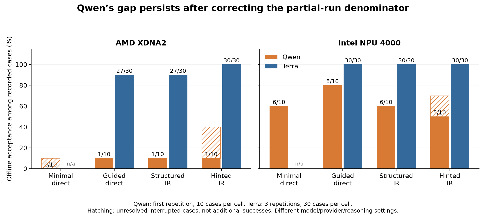

# Why the interrupted Qwen run differs from Terra

The saved evidence shows a real loss of backend-code and repair reliability, plus a separate repetition problem that wastes substantial generation time. Partial-campaign reporting and interrupted-call accounting make the displayed results look worse and the timing harder to interpret. The evidence does **not** show that the structured IR itself usually fails: Qwen produced an executable, validated IR in 18 of its 20 structured-IR cases.

This is an offline audit of the requested [Qwen backup](../../case-study-v3-openrouter-interrupted-backup-20260917T031835Z/) against the latest completed [Terra case-study-v2 campaign](../../case-study-v2-recovered/). It compares saved model prompts, responses, per-cycle validation, metrics, and frozen source/environment identities. The older September 11 IR-evolution run is a different development history; it is not the primary comparator here. No new model or compiler experiments were run, and the source runs were not edited.

## 1. Correct the denominators before comparing

Qwen has one recorded repetition: 80 cases across four arms. Of these, 28 passed, 46 exhausted their cycle budget, and six were blocked after interrupted responses were lost. Two further repetitions had not started in this backup. Terra has three completed repetitions, including two additional ablation arms that have no counterpart in Qwen v3.

| Target | Arm | Qwen solved / recorded | Qwen blocked | Terra solved / recorded | Terra successes by repetition |
| --- | --- | ---: | ---: | ---: | --- |
| AMD | Minimal direct | 0/10 | 1 | Not run | — |
| AMD | Guided direct | 1/10 | 0 | 27/30 | 9, 9, 9 |
| AMD | Structured IR | 1/10 | 0 | 27/30 | 8, 10, 9 |
| AMD | Hinted IR | 1/10 | 3 | 30/30 | 10, 10, 10 |
| Intel | Minimal direct | 6/10 | 0 | Not run | — |
| Intel | Guided direct | 8/10 | 0 | 30/30 | 10, 10, 10 |
| Intel | Structured IR | 6/10 | 0 | 30/30 | 10, 10, 10 |
| Intel | Hinted IR | 5/10 | 2 | 30/30 | 10, 10, 10 |

The original campaign table uses **planned** denominators: for example, AMD guided direct is printed as 1/30, although only ten such cases were recorded. That is progress against the campaign plan, not a completed-run 3.3% accuracy estimate. The relevant observed fraction is 1/10. Blocked cases remain unresolved rather than being classified as model failures.

Across the three shared arms, the recorded outcomes are Qwen **22 passed, 33 failed, 5 blocked out of 60**, versus Terra **174 passed and 6 failed out of 180**. Even if all five interrupted shared-arm cases eventually passed, that Qwen repetition would reach only 27/60. The interruption therefore cannot explain the bulk of the gap. In particular, Qwen's AMD guided-direct and structured-IR arms each completed all ten cases without an infrastructure blocker and solved only one.

[SVG](acceptance_comparison.svg) · [Per-kernel outcomes PNG](kernel_outcomes.png) · [Per-kernel outcomes SVG](kernel_outcomes.svg)

## 2. What was actually held constant

For each shared arm/kernel/target, Qwen's initial stage was compared with all three Terra repetitions: **180/180 prompt texts, saved response schemas, and provider schema hashes match exactly**. This covers the initial code prompt for guided direct and the initial intermediate prompt for both IR arms. Later code and repair prompts naturally diverge because the generated intermediates and failures differ.

The corpus hashes match. Both targets have matching compiler image IDs, installed tools, compile flags, and target profiles. Frozen `playground/tools`, the simulator, the IR validator, and compiler orchestration are unchanged. The broader toolchain fingerprint changes because it also includes provider, model-schema, experiment, workflow, and reporting source files. Inspecting those changes does not reveal a changed acceptance rule for the shared arms: the model-schema edit permits the new provider, and the new minimal-guidance branch applies to `baseline_minimal`.

The inference systems are different: Terra ran through the isolated Codex CLI with explicitly requested `xhigh` reasoning; Qwen ran through OpenRouter's `siliconflow/fp8` route with temperature 0.7, top-p 0.8, top-k 20, and a 32,768-output-token cap. Its metadata records reasoning effort as `none`. These observations compare those complete model/provider/configuration combinations. They do not isolate model weights, numerical precision, sampling, provider behavior, or reasoning budget as the single cause. Identical application prompts also do not establish identical provider-level system instructions.

Terra's recovered run has its own provenance: 100 saved responses were reused after narrowly allowing an expected disabled-code-mode diagnostic; no backend attempts preceded that recovery. Its first repetition includes a recovery pause. That limits clean timing comparisons, while the final case outcomes and saved responses remain available for inspection.

## 3. Structured IR is mostly correct; backend translation is the bottleneck

Qwen obtained a passing executable semantic IR in **9/10 AMD cases and 9/10 Intel cases**. The two cases with no passing IR are layer normalization, one per target. Of the 18 cases with a passing IR, only seven passed the complete offline pipeline: eleven still failed downstream.

The IR expresses the intended math but does not automatically produce valid OpenVINO calls, correct MLIR-AIE transport, or a matching runtime buffer interface. Backend generation is another model call and has no guarantee of preserving the validated representation.

Concrete saved examples:

- **AMD structured vector addition:** the IR correctly has two inputs (`x`, `y`) and one output, each of length 4096. The generated MLIR runtime sequence has only two buffers. It follows the one-input/one-output shape of the prompt's transport example instead of adapting it to the three-buffer manifest. All ten cycles report `runtime ABI argument count mismatch`. The next code prompt contains that error, so this is not missing feedback. [Case report](../../case-study-v3-openrouter-interrupted-backup-20260917T031835Z/repeat-001/20260917T023536Z/structured_ir/14db8012dcb541bfbdefbd2820cf9cf5/report.json)
- **Intel structured transpose:** every cycle fails on an invalid OpenVINO keyword. The sequence is `axes`, `permutation`, `axes`, `perm`, `axes`, `perm`, `axes`, `perm`, `axes`, `permutation`. The semantic transpose does not fix the model's uncertainty about the installed API. [Case report](../../case-study-v3-openrouter-interrupted-backup-20260917T031835Z/repeat-001/20260917T023536Z/structured_ir/e9350f9ad8354e2db3df037c3b4f6e0c/report.json)
- **AMD guided matrix multiplication:** raw MLIR syntax appears directly in Python source, leading to `SyntaxError: invalid decimal literal`. The final cycle still has the same error. Other AMD cases use unavailable Python modules, invalid tile placement, or mismatched buffer shapes. [Case report](../../case-study-v3-openrouter-interrupted-backup-20260917T031835Z/repeat-001/20260917T023536Z/baseline/6399fad4570b4766a2f2a86ad07c8353/report.json)
- **Intel guided moving average:** the first cycle uses nonexistent `ov.Type.bool`; the final cycle uses nonexistent `ov.opset10.zeros_like`. Repairs substitute other unsupported API guesses rather than reaching a working graph. [Case report](../../case-study-v3-openrouter-interrupted-backup-20260917T031835Z/repeat-001/20260917T023536Z/baseline/da3f884231d84197b6269504983b7714/report.json)

A target binary compiling is not enough: Qwen's AMD guided-direct arm had at least one target-compilation pass in six cases but only one case passed the full offline contract. The host/dataflow checks catch additional interface and execution problems. These results concern this evaluator's supported surface and numerical contract, not arbitrary code that might work on physical hardware.

## 4. Repeated repair calls often do not change the code

Comparing the complete `files` arrays of successive saved backend bundles within each case, across the three shared arms:

- Qwen: **179/309 comparisons (57.9%) are identical**.
- Terra: **0/152 comparisons are identical**.

These are successive saved code bundles, excluding cycles that never produced a bundle; they are not all model calls or IR reuse events. Across all four Qwen arms there are 246 identical-bundle pairs, and each pair has distinct OpenRouter generation IDs. All 668 returned Qwen calls have unique generation IDs and report the requested model and SiliconFlow provider. Thus this is not merely counting a single checkpointed response multiple times. It does not, by itself, establish what happened internally at the upstream service.

Ten cycles therefore buy Qwen much less useful search in this run. The model frequently preserves the same failed files or oscillates among the same unsupported guesses despite seeing the previous error. Terra's different successive code does not guarantee that every edit is useful, but its case outcomes show much more successful repair under this contract.

## 5. The long hinted-IR calls contain repetitive generation

Qwen has 674 recorded call entries: 652 completed, 16 rejected, and six blocked with lost responses. Of the 668 returned calls, 13 ended at the 32,768-token output limit. Two other responses failed schema validation after a normal stop, and one ended with provider finish reason `error`; that last event should not be interpreted as proof of a purely model-caused formatting defect.

The 13 capped calls emitted **425,984 output tokens**, or **42.5% of all known Qwen output tokens**, despite being only 1.9% of returned calls. They consumed **179.3 summed model-call minutes**, or 37.0% of known model-call time. Those are sums across concurrent calls, not campaign wall time. Individual capped calls took roughly 12–19 minutes. Terra's 868 saved responses all completed successfully at the provider/schema layer; no rejected or lost response is recorded in this recovered Terra campaign. Its provider does not record the same finish-reason field, so the comparison is about saved failures rather than identical provider telemetry.

The capped output is visibly repetitive:

- Hinted image convolution repeats `ROW_MAJOR_LAYOUT` through most of its output.
- Hinted reduction repeats a hexadecimal identifier pattern.
- Hinted matrix multiplication emits thousands of repeated zero constants.
- Other calls repeat arithmetic chains, decorators, includes, or import statements.

The feedback path amplifies this behavior. `_repair_context` retains a rejected call's raw response and `_feedback` serializes it into the next prompt. For hinted transpose, the prompt grows from **2,093 to 197,073 characters**; for hinted convolution, from **2,444 to 188,082**. The transpose and vector-add cases each produce exactly the same capped raw response again on the next call, with a different generation ID. The report preserves this sequence; it supports a repetition/feedback-loop explanation, but it does not prove whether the original trigger is model, decoding, or serving behavior.

Most returned Qwen calls do produce acceptable structured JSON. The issue is not a universal JSON failure: a small number of extreme generations dominate output cost, while many schema-valid bundles still contain invalid backend code.

## 6. Two reporting effects need care

1. **Planned denominators and token completeness.** The campaign summary divides by three planned repetitions and calls aggregate token totals unknown until all expected rows exist. Consequently, even an arm with ten complete-usage cases can display `unknown` because twenty requested cases are absent. Separately, the six interrupted calls really do have unknown usage. These are different reasons for missing campaign totals.
2. **Interrupted case durations are under-recorded.** The six blocked case rows sum to only **0.191 seconds** of recorded case duration after resume, despite containing **9,086.8 seconds (151.4 minutes)** of previously saved provider calls. The interrupted session did not preserve its full running-case clock, and the quick resume-to-block action supplied the small duration. Those case clocks cannot support a reliable Qwen-versus-Terra speed claim. The saved provider timings provide a lower bound on known work; they cannot recover time or tokens from the lost responses.

The experiment-level status `completed` means its scheduler has resolved all case entries, including failed and blocked ones. It does not mean every case succeeded. The outer campaign remains interrupted because its evidence gate rejects the six blocked cases.

## 7. What the evidence supports doing next

Keep the current frozen campaign as evidence. For a separately named diagnostic experiment, the most informative small tests would be:

1. **Isolate repetition handling:** use the same saved failure prompts, suppress the raw truncated response in feedback, and retain a short error plus a bounded excerpt. Compare output length, repetition, and recovery rate. Keep the model and backend acceptance unchanged.
2. **Isolate backend/API support:** test the failing transpose and vector-add cases with exact installed-API examples and an explicit requirement to adapt the transport argument list to every manifest tensor. Then test a deterministic lowering/template for a supported IR operation as a separate system variant. Changing the lowering implementation changes the system under comparison and must be labeled.
3. **Test decoding or provider hypotheses separately:** a fixed small prompt set can compare one sampling, output-limit, or endpoint setting at a time. The present data do not justify blaming FP8, choosing a new model, or changing several controls together. Lowering the output limit alone bounds waste but does not repair the underlying repetition.

The practical interpretation is that **correct intermediate math helps only when the later backend generator can faithfully implement it**. Terra largely does so in this case study; this served Qwen configuration often fails on API/transport details and does not escape its own failed outputs. That explains why the IR workflows lose much of their benefit here without implying that IR is generally harmful or that model size alone accounts for the difference.

## Artifacts and verification

- [Reproducible analysis script](analyze.py)
- [Machine-readable summary](summary.json)
- [All case metrics](cases.csv) and [call audit](calls.csv)
- [Input evidence hashes](source_hashes.json)

Reproduce with `.venv/bin/python runs/analysis/qwen-terra-20260917/analyze.py` from the repository root. It reads the two saved campaigns, writes only this analysis directory, checks the 80/300 case counts and Qwen outcome totals, and verifies that the hashed source reports and metadata are unchanged after analysis. Generated plots were visually inspected. No model calls, compiler jobs, or edits to the experiment implementation were performed.
