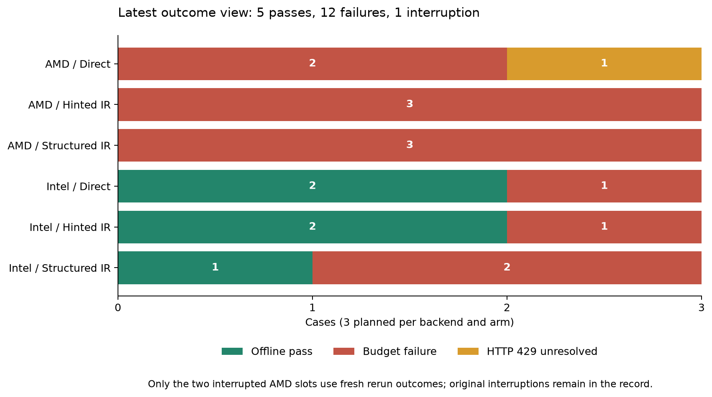
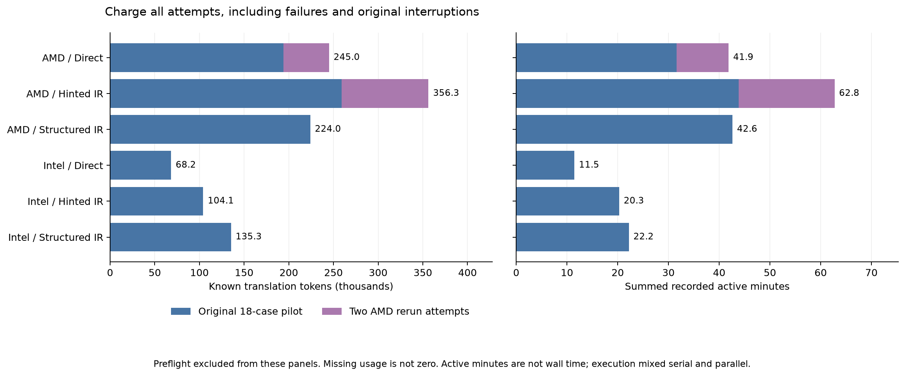
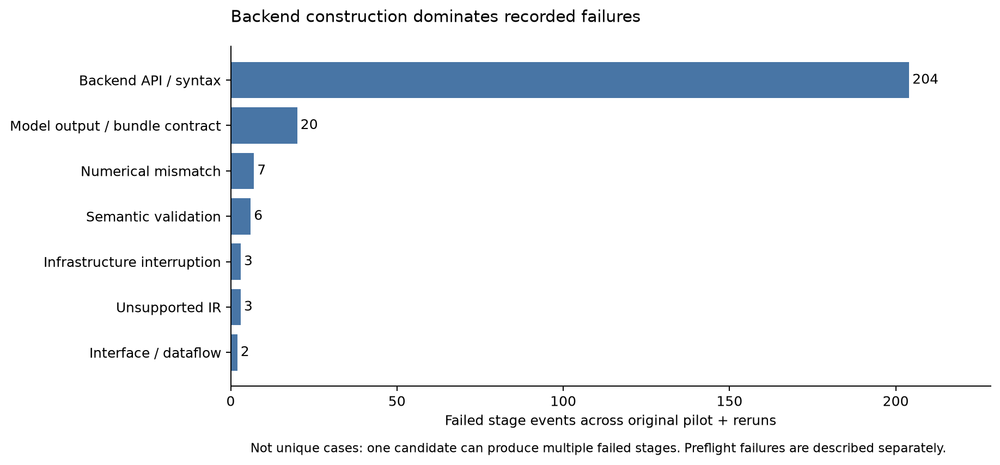

# Phase 1 — combined pilot and AMD rerun report

**Latest result: 5 offline successes, 12 budget-exhausted failures, and 1 unresolved HTTP 429 interruption across 18 case slots. Known spending for all associated attempts and preflights is $1.0403365089. All experiment processes have stopped.**

This is the single reading view for the original pilot, its parallel continuation, and both AMD replacement attempts. The charts and tables below include the reruns; no other report is needed to follow the findings. Original evidence is retained for auditing.

## What we found

1. **Backend code construction is the main obstacle.** Most failures were unavailable APIs, invalid Python/MLIR, or incompatible constructor arguments. Validated semantic IR did not reliably produce a working backend implementation.
2. **Structured IR showed no advantage in this pilot.** Intel direct and hinted each passed 2/3 tasks; structured passed 1/3 while using more tokens. With only three families and one repetition, this does not establish that IR is generally worse.
3. **Layer normalization has a source/acceptance-contract discrepancy.** Seven Intel host validations failed only the numerical boundary case, with the same error metrics observed when executing the original Triton source. The failures remain failures under the frozen tolerance.
4. **Repair did not always act on feedback.** Hinted Intel layer normalization repeated the disallowed filename `./model.py` for ten cycles without reaching compilation.
5. **The AMD reruns did not add a success.** Hinted IR completed ten cycles of backend-construction failures. Direct hit another HTTP 429 after four compiler attempts and remains unresolved.

## Results, including the requested reruns

| Backend | Kernel | Direct | Hinted IR | Structured IR |
| --- | --- | --- | --- | --- |
| AMD | Vector addition | Fail | Fail | Fail |
| AMD | Transpose | Interrupted (rerun) | Fail (rerun) | Fail |
| AMD | Layer normalization | Fail | Fail | Fail |
| Intel | Vector addition | Pass | Pass | Fail |
| Intel | Transpose | Pass | Pass | Pass |
| Intel | Layer normalization | Fail | Fail | Fail |

**How to read this:** “Pass” means target compilation and the configured offline correctness checks passed. It does not mean execution on physical NPU hardware. “Fail” means the per-case repair/token budget was exhausted. “Interrupted” is a provider failure, not evidence of candidate correctness or incapability.

The original pilot ended with **5 passes, 11 failures, 2 interruptions**. Only the two interrupted AMD transpose slots were replaced in the latest outcome view. Those replacements are fresh attempts with fresh per-case budgets; this is not an uninterrupted equal-total-budget experiment. Original attempts remain included in work and spending below.

## Tokens, active time, and repair work

| Backend / arm | Latest passes | Original pilot tokens | Added rerun tokens | Total known translation tokens | Summed active minutes | Backend attempts |
| --- | ---: | ---: | ---: | ---: | ---: | ---: |
| AMD / Direct | 0/3 | 194,099 | 50,861 | 244,960 | 41.88 | 23 |
| AMD / Hinted IR | 0/3 | 259,113 | 97,167 | 356,280 | 62.75 | 31 |
| AMD / Structured IR | 0/3 | 223,980 | 0 | 223,980 | 42.63 | 18 |
| Intel / Direct | 2/3 | 68,215 | 0 | 68,215 | 11.48 | 16 |
| Intel / Hinted IR | 2/3 | 104,121 | 0 | 104,121 | 20.31 | 8 |
| Intel / Structured IR | 1/3 | 135,317 | 0 | 135,317 | 22.22 | 19 |

These totals include all original pilot cases and both AMD reruns, including failed and interrupted work. They exclude preflight and the earlier aborted pilot attempt; all known monetary charges are included in the next section. Missing request usage is not zero. Reasoning tokens are already included in output tokens.

**Timing:** the six-case Intel parallel segment took **11.45 minutes of elapsed wall time**, using eight available workers and four compiler slots. That is not a measured speedup against a serial replay. Case active time includes compiler queueing, sums concurrent work, and spans mixed serial/parallel execution; it must not be interpreted as campaign wall time or a clean arm-level speed comparison.

## Complete spending history and accounting limits

| Component | Known billed cost (USD) |
| --- | ---: |
| Initial pilot attempt (stopped early) | $0.1870210641 |
| Main 18-case pilot, including preflight | $0.7276588137 |
| Route-health probe | $0.000005928 |
| AMD rerun launch: failed schema preflight | $0.003565692 |
| AMD rerun: passed preflight and two attempts | $0.1220850111 |
| **Total known spending** | **$1.0403365089** |

All **195** recorded generation charges were reconciled exactly against saved provider records. The AMD rerun request added **$0.1256507031**, including its failed preflight launch. No request remains pending.

**Five historical requests lack complete billing identity/cost:** one from the initial wrong-key preflight, one from the early stopped pilot, two HTTP 429 calls in the main pilot, and one new HTTP 429 during the AMD direct rerun. Their cost remains unknown. Consequently, complete accounting is still false; rerunning does not repair the missing historical records. No billing-limit error was established by these HTTP 429 records.

## Failure analysis

Failure counts above are **stage events**, not unique cases: a single invalid graph can cause both graph-construction and target-compilation failures. All 18 original case records and both rerun records have hash-bound cycle reviews.

| Area | Observed failure | Interpretation |
| --- | --- | --- |
| AMD backend generation | Missing Python modules, unsupported MLIR operations, invalid syntax and DMA/interface declarations | Primarily backend construction, often before numerical execution |
| Intel structured vector addition | Valid IR followed by repeated OpenVINO import/parameter errors | Semantic validation alone did not resolve backend API usage |
| Intel layer norm, hinted | `./model.py` rejected instead of required `model.py`, ten times | Model-output/evaluator filename contract, not NPU numerical failure |
| Intel layer norm, direct/structured | Seven host runs failed only `operation_boundary` | Numerical contract needs investigation; preserve frozen outcomes |
| HTTP 429 cases | Missing generation identity and usage | Infrastructure interruption; not a zero-cost or successful translation |

The seven boundary failures each recorded **1,280 mismatches**, maximum absolute error **1.5020370483398438e-5**, and maximum scaled error **1.365878858816452**. The other eleven inputs passed. These metrics match the independently executed original Triton source discrepancy; matching finite-test metrics does not prove whole-domain equivalence.

## Rerun and execution history

1. The initial pilot attempt stopped early with missing provider accounting. Its costs and failures were retained.
2. The main 18-case pilot ran with fixed model/prompt/acceptance settings. Two AMD transpose cases encountered HTTP 429. At the user’s request, six remaining Intel cases ran in parallel.
3. The user requested fresh attempts for the two interrupted AMD slots. The first launch failed the model’s IR-schema preflight before either case started; its cost was retained.
4. The next launch passed preflight but exposed a fresh-database SQLite initialization race. The parallel runner was fixed to initialize WAL/schema before worker threads; clean checkpoints resumed without repeating preflight.
5. Both AMD cases started concurrently. Direct hit another HTTP 429 on cycle 5. The hinted response was saved, and that case resumed to its ten-cycle limit without regenerating saved work.

## All 18 case slots

The selected attempt supplies the outcome; “all-attempt tokens” also charges the original interrupted attempt. Preflight is accounted separately above.

| Backend | Kernel | Arm | Original → latest | Selected-attempt tokens | All-attempt tokens |
| --- | --- | --- | --- | ---: | ---: |
| AMD | Vector addition | Direct | Fail | 87,305 | 87,305 |
| AMD | Vector addition | Hinted IR | Fail | 93,340 | 93,340 |
| AMD | Vector addition | Structured IR | Fail | 79,689 | 79,689 |
| AMD | Transpose | Direct | Interrupted → Interrupted | 50,861 | 50,861 |
| AMD | Transpose | Hinted IR | Interrupted → Fail | 97,167 | 153,224 |
| AMD | Transpose | Structured IR | Fail | 86,392 | 86,392 |
| AMD | Layer normalization | Direct | Fail | 106,794 | 106,794 |
| AMD | Layer normalization | Hinted IR | Fail | 109,716 | 109,716 |
| AMD | Layer normalization | Structured IR | Fail | 57,899 | 57,899 |
| Intel | Vector addition | Direct | Pass | 9,048 | 9,048 |
| Intel | Vector addition | Hinted IR | Pass | 32,092 | 32,092 |
| Intel | Vector addition | Structured IR | Fail | 51,287 | 51,287 |
| Intel | Transpose | Direct | Pass | 11,231 | 11,231 |
| Intel | Transpose | Hinted IR | Pass | 22,078 | 22,078 |
| Intel | Transpose | Structured IR | Pass | 18,716 | 18,716 |
| Intel | Layer normalization | Direct | Fail | 47,936 | 47,936 |
| Intel | Layer normalization | Hinted IR | Fail | 49,951 | 49,951 |
| Intel | Layer normalization | Structured IR | Fail | 65,314 | 65,314 |

## Scope, verification, and conclusion

Configuration: **deepseek/deepseek-v3.2**, pinned **alibaba/fp8** route, reasoning enabled; three kernel families, two backends, three arms, one repetition. Per-case limits remained 10 cycles, 100,000 tokens and 1,800 active seconds, checked at stage boundaries. Prompts, sources, model settings and acceptance criteria were preserved across the replacement attempts.

Verification completed previously: the Phase 1 full suite passed **256 tests with 25 skipped**. After the fresh-database fix, **36 focused tests passed**. For this consolidated report, source review hashes, selected outcomes, ledger charges, absence of pending requests, and chart/table totals were rechecked. No new model calls were made to build this report.

**Conclusion:** this pilot identifies backend API reliability, repair behavior and numerical contracts as the main issues to address. It does not establish a general IR advantage, generalization to held-out families, or physical NPU performance. One AMD slot remains interrupted and historical accounting is incomplete. Phase 2’s complete-accounting gate remains unsatisfied; no later research phase was started.

### Reproducibility files (optional)

This report contains the full reading view. For auditing only: [original audit](audit.json), [rerun audit](../amd-interruption-rerun/audit.json), [combined case table](../amd-interruption-rerun/resolved-pilot-cases.csv), and [consolidated report data](combined-data.json). Rebuild with `.venv/bin/python research/build_phase1_report.py`. Each chart is also saved as SVG beside its PNG.
